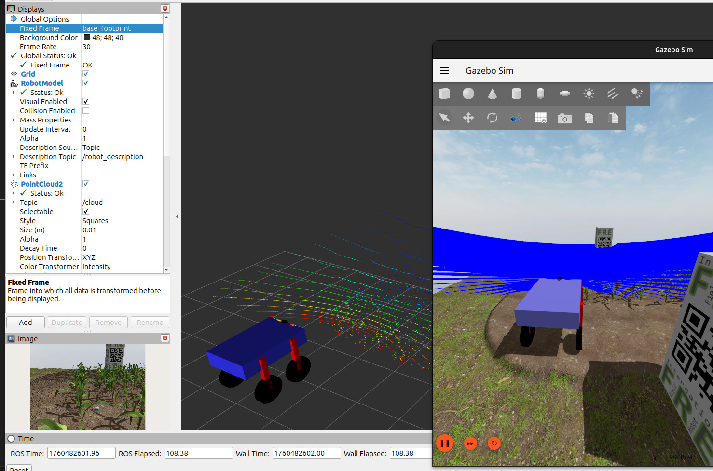

## Faucon description repertoire

# Virtual Maize Field – Demo de lancement (ROS 2 + Gazebo)

Ce dépôt lance un robot URDF dans un monde Gazebo (champ de maïs virtuel), avec ponts ROS ↔ Gazebo et visualisation RViz.



---

## Prérequis

- ROS 2 (Humble ou +)
- `ros_gz_sim`, `ros_gz_bridge`, `ros_gz_image`
- Un workspace ROS 2 (ex. `~/ros2_ws`)

---

## Dépendance requise : `virtual_maize_field`

Ce projet dépend du package **virtual_maize_field**. Clone dans le dossier `src/` de ton workspace **avant** de construire :

```bash
# Crée ton workspace ROS 2
mkdir -p ~/ros2_ws/src && cd ~/ros2_ws/src

# Clone ce dépôt 
git clone git@github.com:themasterofarts/Faucon_Base_Desc.git

# Clone la dépendance depuis le repo de l'organisation
git clone git@github.com:themasterofarts/virtual_maize_field.git

# Installe les dépendances et compile
cd ..
rosdep install --from-paths src --ignore-src -y
colcon build
source install/setup.bash