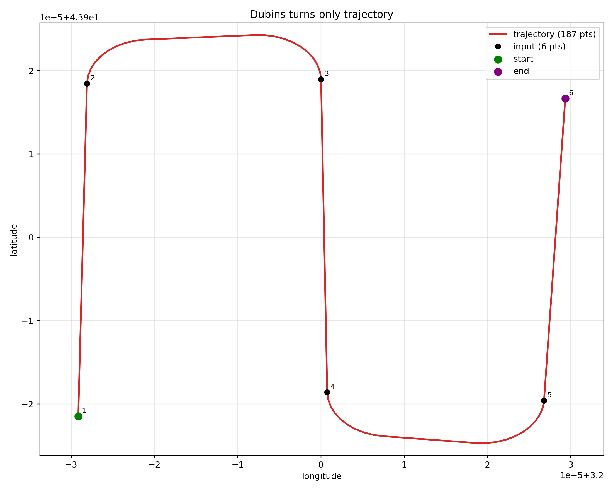
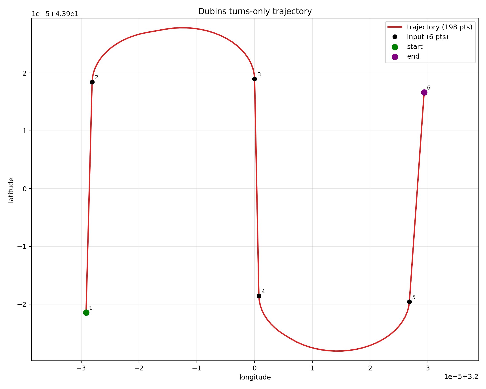
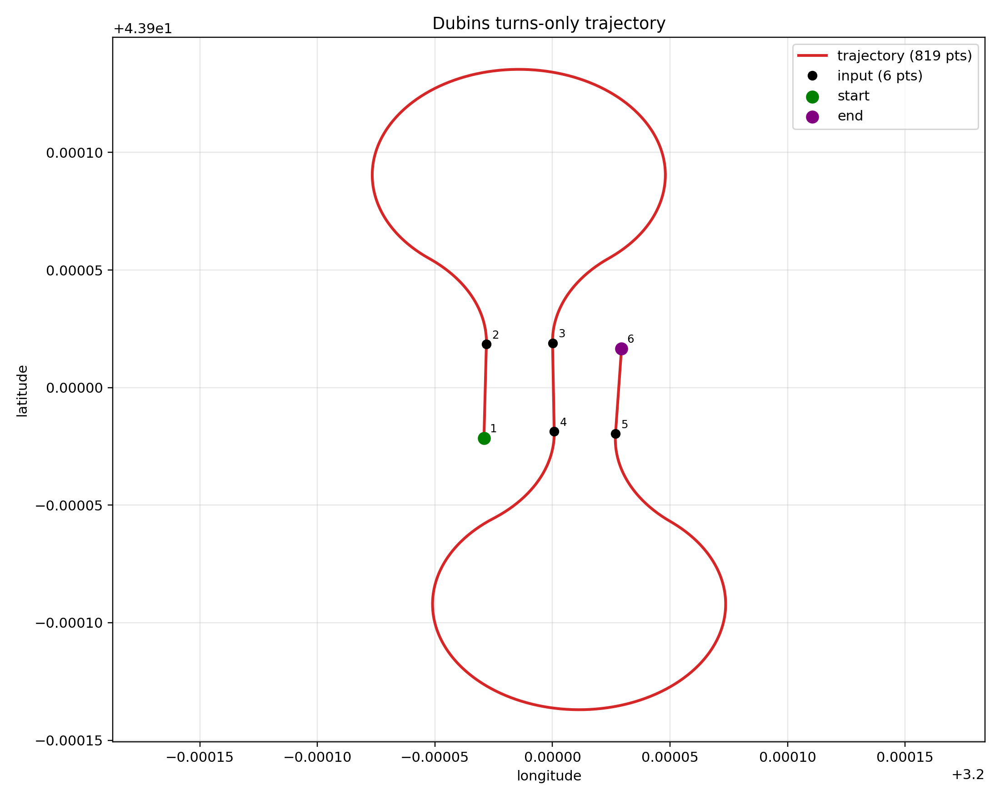

# Trajectory Generator module

`trajectory_generator.py` genere une trajectoire YAML a partir de waypoints YAML.

Le script est independant de ROS/Nav2:
- pas de publication de topics
- conversion GNSS -> local -> GNSS active par defaut
- pipeline `read -> generate -> write`

## 1) Mode de generation (unique)

Mode rangs uniquement:
- segments `1->2`, `3->4`, `5->6`... en ligne droite
- segments `2->3`, `4->5`... en virages Dubins

Format de points attendu:
- ordre: `[entree_rang1, sortie_rang1, entree_rang2, sortie_rang2, ...]`
- nombre pair de points

Notes:
- les `yaw` d'entree ne sont pas utilises
- `step` et `turn-radius` sont en metres (par defaut, avec conversion GNSS->local)

## 2) Format YAML d'entree

Exemple minimal:

```yaml
waypoints:
  - latitude: 43.8999785
    longitude: 3.1999708
  - latitude: 43.9000184
    longitude: 3.1999718
```

Par defaut:
- liste entree: `waypoints`
- cles: `latitude`, `longitude`

## 3) Parametres CLI

- `--step`: pas d'echantillonnage (m)
- `--turn-radius`: rayon de virage (m)
- `--origin-lat`, `--origin-lon`: origine locale optionnelle (sinon 1er waypoint)
- `--no-gnss-to-local`: desactive la conversion GNSS -> local -> GNSS
- `--earth-radius-m`: rayon terrestre pour la conversion (defaut `6378137.0`)
- `--no-yaw`: ne pas ecrire le yaw de sortie
- `--visualize`: genere un PNG
- `--plot-output`: chemin PNG
- `--input-list-key`, `--output-list-key`, `--x-key`, `--y-key`, `--yaw-key`: personnalisation des cles YAML

## 4) Commandes recommandees

Les commandes ci-dessous sont a lancer depuis la racine du depot (`Faucon_ma64`).

### Generation trajectoire

```bash
python3 faucon_navigation/scripts/trajectory_generator.py \
  --input config_point/gps_waypoints.yaml \
  --output config_point/trajectory_turns_only.yaml \
  --step 0.1 \
  --turn-radius 1.0
```

### Generation + visualisation

```bash
python3 faucon_navigation/scripts/trajectory_generator.py \
  --input config_point/gps_waypoints.yaml \
  --output config_point/trajectory_turns_only.yaml \
  --step 0.1 \
  --turn-radius 1.0 \
  --visualize
```

### Avec origine locale explicite

```bash
python3 faucon_navigation/scripts/trajectory_generator.py \
  --input config_point/gps_waypoints.yaml \
  --output config_point/trajectory_turns_only.yaml \
  --step 0.1 \
  --turn-radius 1.0 \
  --origin-lat 43.8999785 \
  --origin-lon 3.1999708
```

## 5) Comparaison visuelle rapide (`turn-radius`)

Meme jeu de waypoints, meme `step=0.1`, seul le rayon change.

### `turn-radius=0.6` (serre)



Virages tres serres. Plus agressif pour le robot.
Lien direct: [turn_radius_0_6.png](./plots/turn_radius_0_6.png)

### `turn-radius=1.0` (recommande)



Bon compromis. Point de depart recommande.
Lien direct: [turn_radius_1_0.png](./plots/turn_radius_1_0.png)

### `turn-radius=5.0` (trop grand ici)



Boucles tres larges. Trop grand pour cet ecartement.
Lien direct: [turn_radius_5_0.png](./plots/turn_radius_5_0.png)

Reglage terrain conseille:
- commencer a `1.0`
- ajuster progressivement (`0.8`, `1.2`, etc.) selon le comportement reel du robot

## 6) Sortie YAML

Par defaut:
- liste sortie: `waypoints`
- cles: `latitude`, `longitude`
- `yaw` inclus (sauf `--no-yaw`)
